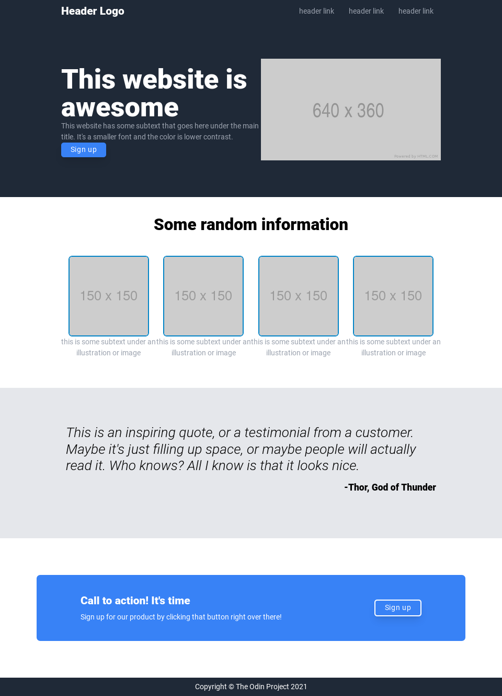

# Landing Page

Creating the clone of the webpage provided in the assignment page.
This was the first time I tried to use tailwind css, as such there improvements.

## Known Bugs

On longer screens, the margin between the footer and the rest of the content is exaggerated.

## Reflections

I found tailwind to be an easier approach to css, even though it made the html look littered with a lot of inline styles. It just feels like css, but shorter.

Original: 

Demo:

